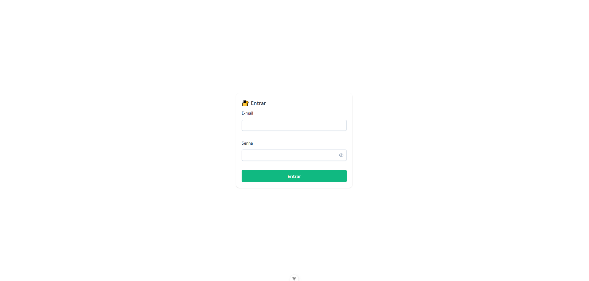
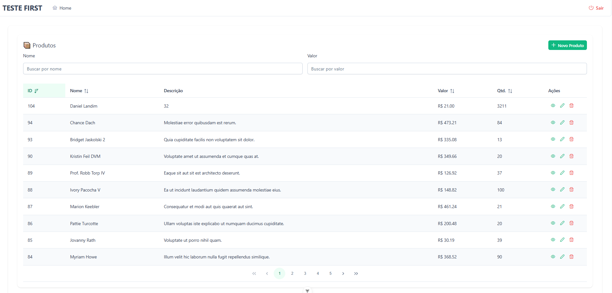
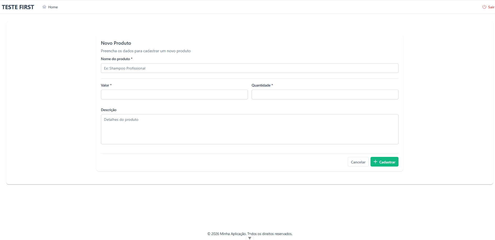
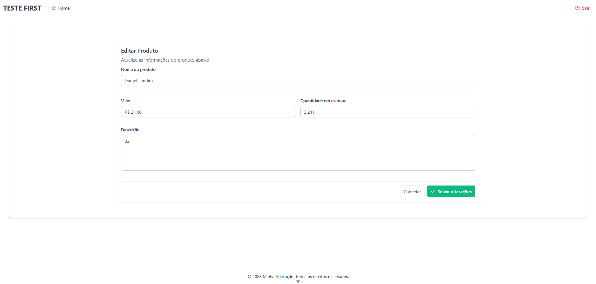

# 🚀 Teste Técnico - Desenvolvedor PHP (Laravel) - First Decision

## 📌 Descrição do Projeto

Este projeto é uma aplicação web composta por:

* **Backend**: Laravel atuando como API REST
* **Frontend**: Vue.js (SPA) rodando em container próprio
* **Banco de Dados**: PostgreSQL
* **Infraestrutura**: Docker e Docker Compose

O objetivo é fornecer um ambiente padronizado, simples de subir e fácil de avaliar tecnicamente.

---

## ▶️ Como Executar a Aplicação

### 1️⃣ Clonar o repositório

```bash
git clone <url-do-repositorio>
cd project-root
```

---

### 2️⃣ Subir os containers com Docker

```bash
docker compose up -d --build
```

Esse comando irá subir:

* Laravel (API)
* Nginx
* Vue.js (Vite)
* PostgreSQL

---

### 3️⃣ Configurar o Laravel

Gere a chave da aplicação:

```bash
docker compose exec app php artisan key:generate
```

Execute as migrations e seeders:

```bash
docker compose exec app php artisan migrate --seed
```

---

## 🌐 Acessos da Aplicação

* **Frontend (Vue.js)**: [http://localhost:5173](http://localhost:5173)
* **Backend (Laravel API)**: [http://localhost:8000](http://localhost:8000)

---

## 🧪 Como Executar os Testes

Para rodar os testes automatizados do Laravel:

```bash
docker compose exec app php artisan test
```

ou

```bash
docker compose exec app vendor/bin/phpunit
```

---

## 🖼️ Prints / GIFs

### 🔐 Autenticação



### 📦 Produtos – Listagem



### 📄 Produtos – Visualização


### ➕ Produtos – Cadastro



### ✏️ Produtos – Edição



### 🗑️ Produtos – Exclusão


---

## ℹ️ Observações

* O frontend e o backend rodam em containers separados
* O banco de dados utiliza volume persistente
* Ambiente pronto para avaliação técnica
